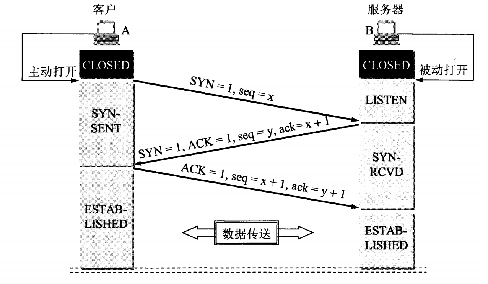
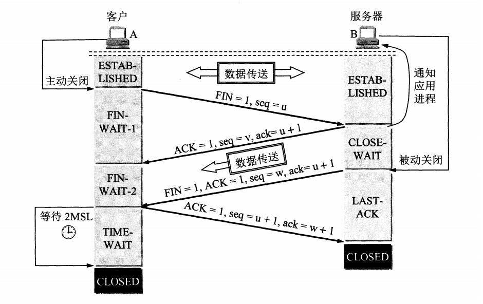

# TCP

Transmission Control Protocol，传输控制协议。数据单元：TCP 报文段。

TCP 是面向连接的、可靠的、基于字节流的运输层通信协议。

- 面向连接，一对一
- 可靠，保证报文端一定能够到达接收端
- 字节流

### 首部字段

- 16 位，源端口号
- 16 位，目的端口号

- 32 位，序号（seq）
    - 建立连接时，生成随机数作为初始值
    - 用来解决报文段乱序问题

- 32 位，确认号（ack）
    - 表示下次期望收到的报文段的 seq
    - 发送方收到这个确认号，就可以认为这个确认号之前的数据都被对方正常接收了

- 控制字段

    - ACK（确认位）：ACK = 1，表示确认号（ack）有效；在 TCP 连接建立后，所有报文段都必须把 ACK 置 1

    - RST（）：RST = 1，表示 TCP 连接中出现异常必须强制断开连接

    - SYN（同步位）：SYN = 1，表示是一个连接请求/连接接受报文段

    - FIN（终止位）：FIN = 1，表示这个报文段发送方数据已发送完，要求释放连接

- 窗口（rwnd）：表示这个报文段的发送方的接受窗口，也就是允许对方发送的数据量

### TCP 连接管理 - 建立连接 - 三次握手

> 建立 TCP 连接要解决的三大问题：
>
> 1. 让 TCP 双方能够确知对方的存在
> 2. 让 TCP 双方能够协商一写参数；如：最大窗口值、MSS等
> 3. 让 TCP 双方能够对系统资源进行分配；如：缓存、变量

**假设 A 为 TCP Client，B 为 TCP Server；Server 现处于 `LISTEN` 状态。**

1. 第一次

    - Client 向 Server 发送「 TCP 连接请求报文段」，并进入 `SYN_SEND` （同步已发送）状态。
    - 「 TCP 连接请求报文段」中，`SYN=1`，`seq=x`。

> TCP 规定，SYN 报文段不能携带数据，但需要消耗掉一个序号。

2. 第二次

    - Server 收到「 TCP 连接请求报文段」后，如果同意建立连接，就向 Client 发送「 TCP 连接请求确认报文段」，并进入 `SYN_RCVD` （同步已接收）状态。
    - 「 TCP 连接请求确认报文段」中，`SYN=1`，`ACK=1`，`seq=y`，`ack=x+1`。

3. 第三次

    - Client 收到「 TCP 连接请求确认报文段」后，还要向 Server 发送一个普通的 TCP 确认报文段，并进入 `ESTABLISHED` （连接已建立）状态。
    - 这个普通的 TCP 确认报文段中，`ACK=1`，`seq=x+1`，`ack=y+1`，**可携带数据**。
    - Server 收到确认报文段后，也进入 `ESTABLISHED` （连接已建立）状态。

> TCP 规定，ACK 报文段可以携带数据，但是如果不携带数据则不消耗序号。

#### 为什么 Client 最后还要发送一次确认（能否改用两次握手）？

**1. 为了防止旧的重复连接初始化造成混乱和浪费资源**

如果使用两次握手，有这样一种场景，

- Client 发送了第一个连接请求报文段 r1，因为在网络结点中滞留的时间太长，Client 迟迟没有收到连接请求确认报文段，以为 Server 没有收到，此时重新向 Server 发送第二个连接请求报文段 r2，然后 Client 和 Server 经过两次握手完成连接，传输数据，然后关闭连接。

- 此时之前滞留的第一个连接请求报文段 r1，终于到达了 Server，这个报文段本该是失效的，但是两次握手的机制会让 Server 再次进入 `ESTABLISHED` 状态，这将导致不必要的错误和资源的浪费。

使用三次握手，就算是第一次失效的连接请求报文段传送过来了，Server 接受到了并且回复了连接请求确认报文段，但是 Client 已关闭不会再次发出确认报文段。由于 Server 收不到确认，就知道 Client 并没有请求连接。

**2. 让双方确认自己与对方的发送与接收是正常的**

| 次序 | Client | Client 状态 | Server | Server 状态 |
| --- | --- | --- | --- | --- | 
| 第一次握手 |  | CLOSE -> SYN_SEND | Server 接受正常 Client 发送正常 | LISTEN |
| 第二次握手 | Client 发送、接收正常 Server 发送、接收正常 | SYN_SEND | Server 为 TCP 连接分配缓存、变量 | LISTEN -> SYN_RCVD |
| 第三次握手 | Client 为 TCP 连接分配缓存、变量 | SYN_SEND -> ESTABLISHED | Server 发送正常 Client 接收正常 | SYN_RCVD -> ESTABLISHED |

### TCP 连接管理 - 释放连接 - 四次挥手

**假设 A 为 TCP Client，B 为 TCP Server。**

1. 第一次

    - 应用进程主动关闭 TCP 连接。（主动关闭连接）
    - Client 发送「 TCP 连接释放报文段」，并进入 `FIN_WAIT_1` （终止等待1）状态。
    -「 TCP 连接释放报文段」中，`FIN=1`，`ACK=1`，`seq=u`，`ack=v`。

2. 第二次

    - Server 收到「 TCP 连接释放报文段」后，会发送一个普通的确认报文段，并进入 `CLOSE_WAIT` （关闭等待）状态。
    - 确认报文段中，`ACK=`，`seq=v`，`ack=u+1`。
    - TCP Server 通知应用进程：Client 要断开 TCP 连接。
    - **此时 TCP 连接处于半关闭状态，Client 不能再发送数据，但 Server 还可以继续发送数据。**
    - Client 收到确认报文段后进入 `FIN_WAIT_2`（终止等待2）状态，等待 Server 发出的「 TCP 连接释放报文段」。

3. 第三次

    - 当应用进程没有数据要发送了，就通知 TCP Server 释放连接。（被动关闭连接）
    - Server 发送「 TCP 连接释放报文段」，并进入 `LAST_ACK` （最后确认）状态。
    - 「 TCP 连接释放报文段」中，`FIN=1`，`ACK=1`，`seq=w`，`ack=u+1`。

4. 第四次

    - Client 收到「 TCP 连接释放报文段」后，发送一个普通的确认报文段，并进入 `TIME_WAIT` （时间等待）状态，**在等待 2 MSL（最大报文存活时间）后才进入 `CLOSE` 状态**。
    - 确认报文段中，`ACK=1`，`seq=u+1`，`ack=w+1`。
    - Server 收到确认报文段后，进入 `CLOSE` 状态。

#### 为什么需要四次挥手？

- 主动关闭连接的一方不再发送数据，但是还能接受数据。

- Server 收到「 TCP 连接释放报文段」后，先返回一个 ACK 报文段，**因为可能还有数据需要发送**，等到数据发送完才发送 FIN 报文段给 Client。

所以被动关闭连接的一方的 ACK 和 FIN 报文段一般会分开发送，这就是为什么至少要四次挥手。

#### 为什么需要 `TIME_WAIT` 状态？

> 主动发起关闭连接的一方，才会有 `TIME-WAIT` 状态。

**1. 保证最后的 ACK 报文段能让「被动关闭方」接收，正常关闭**

如果没有 `TIME-WAIT` 状态，Client 在发送完最后一个 ACK 报文段之后就进入 `CLOSE` 状态。

- 如果这个 ACK 报文段丢失，Server 就会一直处于 `LAST_ACK` 状态，浪费资源。

- 接着 Client 发起新的建立连接请求，Server 会返回 RST 报文端给 Client，新的连接建立的过程就会被终止。

### 参考

- [5.8.1 TCP的运输连接管理 - 湖科大教书匠 - bilibili](https://www.bilibili.com/video/BV1c4411d7jb?p=64)

- [5.3.2 TCP连接管理 - 王道论坛 - bilibili](https://www.bilibili.com/video/BV19E411D78Q?p=64)

- [计算机网络常见面试题 - Snailclimb - GitHub](https://github.com/Snailclimb/JavaGuide/blob/master/docs/network/%E8%AE%A1%E7%AE%97%E6%9C%BA%E7%BD%91%E7%BB%9C.md)

- [两张动图-彻底明白TCP的三次握手与四次挥手](https://blog.csdn.net/qzcsu/article/details/72861891)

- [35 张图解：被问千百遍的 TCP 三次握手和四次挥手面试题 - 小林coding的文章 - 知乎](https://zhuanlan.zhihu.com/p/125715300)